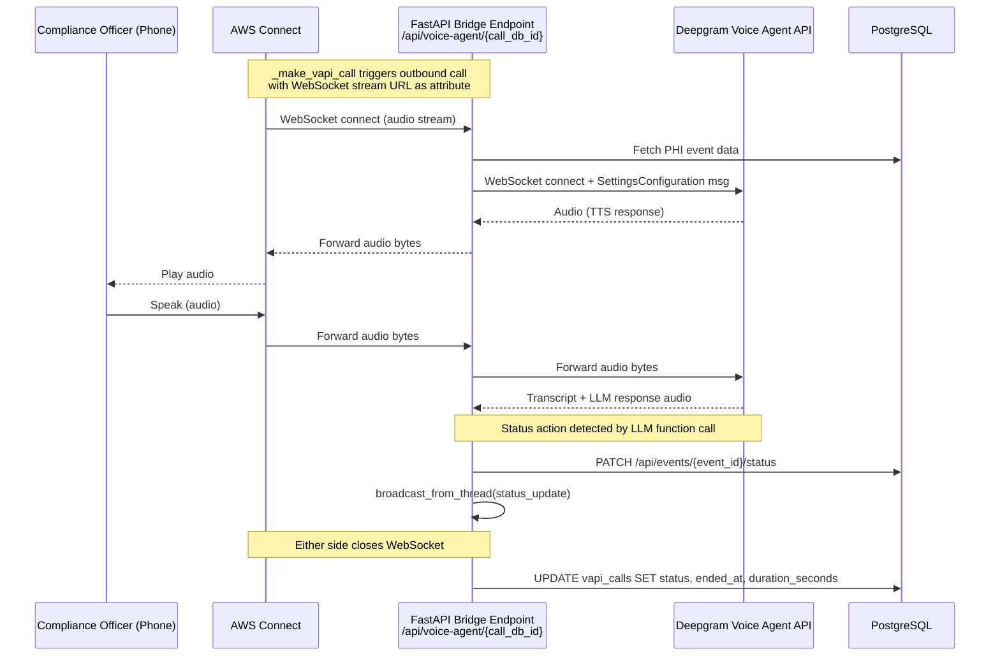

# Design Document: Deepgram Voice Agent

## Overview

This feature replaces the static Amazon Connect + Polly one-way alert call with a conversational voice AI agent powered by Deepgram's Voice Agent API. When a high-risk PHI exposure event is detected, AWS Connect places an outbound call to the compliance officer, but instead of playing a pre-recorded Polly announcement, the audio is bridged to a new FastAPI WebSocket endpoint (`/api/voice-agent/{call_db_id}`) that connects in real-time to Deepgram's Voice Agent API. The compliance officer can then have a two-way conversation — asking questions, requesting details, and verbally triggering status changes (mitigate or resolve) — all without touching the dashboard.

The change is surgical: only `_make_vapi_call` in `vapi_caller.py` changes, and a new WebSocket endpoint is added to `main.py`. All existing cooldown logic, DB tracking, and broadcast infrastructure remain untouched.

## Architecture



### Component Interaction Summary

- `vapi_caller._make_vapi_call` — places the AWS Connect outbound call, passing the Bridge_Endpoint WebSocket URL as a contact flow attribute so Connect streams audio to it.
- `main.py` — hosts the new `/api/voice-agent/{call_db_id}` WebSocket endpoint (the Bridge_Endpoint).
- Bridge_Endpoint — opens a Deepgram Voice Agent WebSocket, relays audio bidirectionally, handles function calls from Deepgram for status actions, and finalizes the `vapi_calls` DB record on close.
- Deepgram Voice Agent API — performs STT, LLM reasoning (with function calling for status actions), and TTS. Configured via a `SettingsConfiguration` message on connect.

## Components and Interfaces

### 1. Bridge Endpoint (`/api/voice-agent/{call_db_id}`)

A new `@app.websocket` route in `main.py`.

**Responsibilities:**
- Accept the AWS Connect audio WebSocket.
- Fetch the PHI event record from the DB using `call_db_id` → `event_id`.
- Open a Deepgram Voice Agent WebSocket with a `SettingsConfiguration` message containing the system prompt and function definitions.
- Run two concurrent async tasks: Connect→Deepgram audio relay and Deepgram→Connect audio relay.
- Handle Deepgram JSON control messages (function call results, conversation end signals).
- On function call for status update: call `PATCH /api/events/{event_id}/status` internally and invoke `broadcast_from_thread`.
- On session end: update `vapi_calls` record with `status`, `ended_at`, `duration_seconds`.

**Signature:**
```python
@app.websocket("/api/voice-agent/{call_db_id}")
async def voice_agent_bridge(websocket: WebSocket, call_db_id: int):
    ...
```

### 2. Deepgram Connection Helper

A small async helper (in `main.py` or a new `deepgram_agent.py` module) that:
- Builds the Deepgram Voice Agent WebSocket URL: `wss://agent.deepgram.com/agent`
- Attaches the `Authorization: Token {DEEPGRAM_API_KEY}` header.
- Returns the open `websockets.WebSocketClientProtocol`.

### 3. Settings Configuration Builder

Builds the JSON `SettingsConfiguration` message sent to Deepgram on connect:

```python
def build_settings(event_data: dict) -> dict:
    return {
        "type": "SettingsConfiguration",
        "audio": {
            "input": {"encoding": "mulaw", "sample_rate": 8000},
            "output": {"encoding": "mulaw", "sample_rate": 8000, "bitrate": 48000}
        },
        "agent": {
            "listen": {"model": "nova-2"},
            "think": {
                "provider": {"type": "open_ai"},
                "model": "gpt-4o-mini",
                "instructions": _build_system_prompt(event_data),
                "functions": [MITIGATE_FUNCTION_DEF, RESOLVE_FUNCTION_DEF]
            },
            "speak": {"model": "aura-asteria-en"}
        }
    }
```

Audio encoding is `mulaw` at 8 kHz to match AWS Connect's standard telephony audio format.

### 4. System Prompt Builder

```python
def _build_system_prompt(event_data: dict) -> str:
```

Constructs a concise system prompt injecting: `ai_service`, `phi_types`, `risk_score`, `severity`, `source_ip`, `redacted_text`, `timestamp`. Instructs the agent to:
- Identify as "ShadowGuard compliance assistant".
- Lead with `ai_service`, `phi_types`, and `risk_score` in the opening statement.
- Ask if the officer wants more detail before elaborating.
- Keep responses to 1–3 sentences.
- Use spoken, conversational language (no markdown or bullet points).
- Confirm before executing status actions.

### 5. Function Definitions (Deepgram Tool Calling)

Two function definitions passed in `SettingsConfiguration.agent.think.functions`:

```python
MITIGATE_FUNCTION_DEF = {
    "name": "mark_mitigated",
    "description": "Mark the PHI event as mitigated after compliance officer confirms.",
    "parameters": {"type": "object", "properties": {}, "required": []}
}

RESOLVE_FUNCTION_DEF = {
    "name": "mark_resolved",
    "description": "Mark the PHI event as resolved after compliance officer confirms.",
    "parameters": {"type": "object", "properties": {}, "required": []}
}
```

When Deepgram calls one of these functions, the Bridge_Endpoint executes the status PATCH and sends a `FunctionCallResponse` back to Deepgram so the agent can verbally confirm.

### 6. Updated `_make_vapi_call`

The only change to `vapi_caller.py`: instead of passing Polly-style `Attributes` to the contact flow, pass the Bridge_Endpoint WebSocket URL so Connect streams audio to it.

```python
def _make_vapi_call(call_db_id: int, event_data: dict, broadcast_fn=None):
    bridge_url = f"wss://{HOST}/api/voice-agent/{call_db_id}"
    client.start_outbound_voice_contact(
        ...
        Attributes={"bridge_url": bridge_url, "event_id": str(event_id), ...},
    )
```

The AWS Connect contact flow must be updated to read `$.Attributes.bridge_url` and use a "Transfer to WebSocket" block to stream audio to that URL.

## Data Models

### Existing Tables (unchanged schema)

**`events`** — PHI event records. The Bridge_Endpoint reads from this table to build the system prompt and writes status updates via the existing `PATCH /api/events/{event_id}/status` endpoint.

**`vapi_calls`** — Call tracking records. The Bridge_Endpoint updates this on session end:

| Column | Type | Written by Bridge_Endpoint |
|---|---|---|
| `status` | TEXT | `'completed'` or `'failed'` |
| `ended_at` | TIMESTAMPTZ | UTC timestamp at close |
| `duration_seconds` | INTEGER | Elapsed seconds since WS connect |

### In-Memory Session State

Each Bridge_Endpoint WebSocket handler holds:

```python
@dataclass
class BridgeSession:
    call_db_id: int
    event_id: str          # UUID string
    started_at: datetime   # UTC, set on WS accept
    connect_ws: WebSocket  # FastAPI WebSocket (AWS Connect side)
    deepgram_ws: Any       # websockets client connection
    broadcast_fn: Callable | None
```

No new DB tables are required.

### Environment Variables

| Variable | Required | Description |
|---|---|---|
| `DEEPGRAM_API_KEY` | Yes (new) | Deepgram API key for Voice Agent |
| `SERVICE_HOST` | Optional | Public hostname for bridge URL construction (falls back to `localhost`) |

All existing AWS/Connect env vars remain unchanged.

## Error Handling

| Scenario | Behavior |
|---|---|
| `DEEPGRAM_API_KEY` not set | Close Connect WebSocket with code 1008, log error, update `vapi_calls` to `failed` |
| Deepgram WebSocket fails to connect | Close Connect WebSocket, update `vapi_calls` to `failed` with error message |
| `PATCH /api/events/{event_id}/status` returns non-2xx | Send `FunctionCallResponse` with error text; agent verbally informs officer to update manually |
| Connect WebSocket closes unexpectedly | Close Deepgram WebSocket, update `vapi_calls` to `failed` |
| Deepgram WebSocket closes unexpectedly | Close Connect WebSocket, update `vapi_calls` to `completed` (conversation ended naturally) or `failed` if error frame received |
| DB error during finalization | Log error; do not re-raise (call already ended) |

All errors are logged via the standard Python `logging` module under the `shadowguard.voice_agent` logger name.

## Correctness Properties

*A property is a characteristic or behavior that should hold true across all valid executions of a system — essentially, a formal statement about what the system should do. Properties serve as the bridge between human-readable specifications and machine-verifiable correctness guarantees.*

### Property 1: Audio Relay Fidelity

*For any* sequence of audio bytes received on either side of the bridge (Connect→Deepgram or Deepgram→Connect), the exact same bytes must be forwarded to the other side without modification, truncation, or reordering.

**Validates: Requirements 1.3, 1.4**

---

### Property 2: Deepgram Connection Uses API Key

*For any* incoming Connect WebSocket connection, the Deepgram Voice Agent WebSocket must be opened with an `Authorization: Token {DEEPGRAM_API_KEY}` header whose value matches the environment variable exactly.

**Validates: Requirements 1.2, 7.1**

---

### Property 3: WebSocket Cleanup on Either Side Close

*For any* bridge session, if either the Connect WebSocket or the Deepgram WebSocket closes (for any reason), the other WebSocket must also be closed before the session terminates.

**Validates: Requirements 1.6, 5.4**

---

### Property 4: System Prompt Completeness

*For any* PHI event record, the system prompt generated by `_build_system_prompt` must contain: the string `"ShadowGuard compliance assistant"`, the values of `ai_service`, `phi_types`, `risk_score`, `severity`, `source_ip`, `redacted_text`, and `timestamp` from the event, an instruction to lead with `ai_service`/`phi_types`/`risk_score`, an instruction to ask before elaborating, an instruction to limit responses to 1–3 sentences, and an instruction to avoid markdown or bullet points.

**Validates: Requirements 2.1, 2.2, 2.3, 2.4, 2.5, 2.6**

---

### Property 5: Status Action Requires Confirmation

*For any* PHI event and any status action (mitigate or resolve), the system prompt must instruct the agent to ask for explicit confirmation from the compliance officer before calling the corresponding function (`mark_mitigated` or `mark_resolved`).

**Validates: Requirements 3.1, 4.1**

---

### Property 6: Status Action PATCH Correctness

*For any* event_id and any status action (mitigate or resolve), when the corresponding Deepgram function call is received, the Bridge_Endpoint must issue a `PATCH /api/events/{event_id}/status` request with the body `{"status": "mitigated"}` or `{"status": "resolved"}` respectively, and the request must target the correct event_id from the active session.

**Validates: Requirements 3.2, 4.2**

---

### Property 7: Broadcast on Successful Status Update

*For any* successful status update (mitigate or resolve), `broadcast_fn` must be called exactly once with a message of type `"status_update"` containing the correct `event_id` and the new status value.

**Validates: Requirements 3.4, 4.4**

---

### Property 8: Call Finalization Correctness

*For any* bridge session that ends (normally or due to error), the `vapi_calls` record identified by `call_db_id` must be updated with: `ended_at` set to a UTC timestamp, `duration_seconds` set to the integer elapsed seconds since the WebSocket was accepted, and `status` set to `'completed'` for normal termination or `'failed'` for error/unexpected disconnect.

**Validates: Requirements 5.2, 5.3**

---

### Property 9: `_make_vapi_call` Triggers Connect Outbound Call

*For any* `call_db_id` and `event_data`, calling `_make_vapi_call` must result in exactly one invocation of `start_outbound_voice_contact` on the boto3 Connect client, targeting `ALERT_PHONE_NUMBER` from `CONNECT_SOURCE_PHONE`.

**Validates: Requirements 6.2**

---

### Property 10: `_make_vapi_call` Passes Full Event Data

*For any* `event_data` dict containing `event_id`, `ai_service`, `phi_types`, `risk_score`, `severity`, `source_ip`, `redacted_text`, and `timestamp`, the `Attributes` passed to `start_outbound_voice_contact` must include all of these fields so the Bridge_Endpoint can initialize the Voice_Agent with complete context.

**Validates: Requirements 6.3**

---

## Testing Strategy

### Dual Testing Approach

Both unit tests and property-based tests are required. They are complementary: unit tests catch concrete bugs in specific scenarios, property tests verify general correctness across all inputs.

**Unit tests focus on:**
- Specific examples (e.g., a known PHI event produces the expected system prompt substring)
- Integration points (e.g., the Bridge_Endpoint route is registered and reachable)
- Edge cases: missing `DEEPGRAM_API_KEY` closes with code 1008; failed PATCH returns the correct error FunctionCallResponse

**Property tests focus on:**
- Universal properties (Properties 1–10 above) across randomly generated inputs
- Audio byte sequences of arbitrary length and content
- PHI event records with arbitrary field values

### Property-Based Testing Library

Use **[Hypothesis](https://hypothesis.readthedocs.io/)** (Python), the standard property-based testing library for the Python ecosystem.

```
pip install hypothesis pytest pytest-asyncio
```

### Property Test Configuration

Each property test must run a minimum of **100 iterations** (Hypothesis default is 100; set `@settings(max_examples=100)` explicitly).

Each test must be tagged with a comment referencing the design property:

```python
# Feature: deepgram-voice-agent, Property 1: Audio relay fidelity
@settings(max_examples=100)
@given(audio_bytes=st.binary(min_size=1, max_size=4096))
def test_audio_relay_fidelity_connect_to_deepgram(audio_bytes):
    ...
```

Tag format: `Feature: deepgram-voice-agent, Property {N}: {property_text}`

### Test File Layout

```
backend/
  tests/
    test_voice_agent_unit.py       # unit + edge case tests
    test_voice_agent_properties.py # property-based tests (Hypothesis)
```

### Key Test Cases

**Unit tests:**
- `test_bridge_endpoint_registered` — GET/WS to `/api/voice-agent/1` returns 101 (not 404)
- `test_missing_api_key_closes_1008` — with `DEEPGRAM_API_KEY` unset, connection closes with code 1008
- `test_patch_failure_returns_error_response` — mock PATCH returning 500, verify FunctionCallResponse contains error text
- `test_system_prompt_contains_identity` — known event produces prompt with "ShadowGuard compliance assistant"

**Property tests (one per property):**
- P1: `test_audio_relay_fidelity` — arbitrary bytes forwarded unchanged in both directions
- P2: `test_deepgram_connection_uses_api_key` — any connection uses the env var value
- P3: `test_websocket_cleanup_on_close` — closing either side closes the other
- P4: `test_system_prompt_completeness` — arbitrary event data → all required fields present in prompt
- P5: `test_status_action_confirmation_in_prompt` — prompt always contains confirmation instruction
- P6: `test_status_action_patch_correctness` — any event_id + action → correct PATCH body
- P7: `test_broadcast_on_status_update` — any successful update → broadcast called once with correct payload
- P8: `test_call_finalization_correctness` — any session duration → correct DB fields written
- P9: `test_make_vapi_call_triggers_connect` — any call_db_id/event_data → start_outbound_voice_contact called once
- P10: `test_make_vapi_call_passes_full_event_data` — any event_data → all fields present in Attributes
