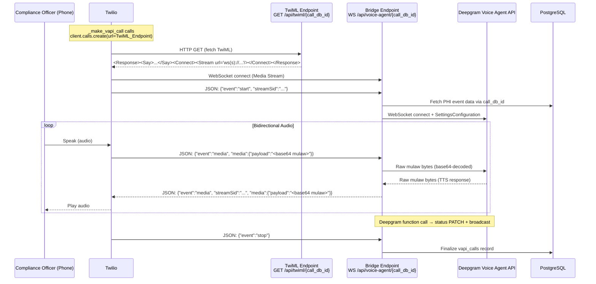

# Design Document: Twilio Voice Migration

## Overview

This feature migrates the outbound telephony provider from Amazon Connect (boto3 `start_outbound_voice_contact`) to Twilio (`client.calls.create()`). The core motivation is that Twilio Media Streams natively support bidirectional WebSocket audio via `<Connect><Stream>` TwiML, eliminating the Kinesis Video Streams + Lambda plumbing that AWS Connect requires.

The migration touches three files and one config:

1. **`vapi_caller.py`** — `_make_vapi_call` swaps boto3 for Twilio `client.calls.create()`, `is_configured()` checks Twilio env vars, `_get_connect_client` is removed, and all Connect-specific constants are replaced with Twilio equivalents.
2. **`main.py`** — A new `GET /api/twiml/{call_db_id}` endpoint returns TwiML XML. The existing `/api/voice-agent/{call_db_id}` WebSocket bridge is updated internally to handle Twilio Media Stream JSON framing (base64 mulaw in JSON `media` events) instead of raw audio bytes.
3. **`.env`** — AWS credentials are replaced with `TWILIO_ACCOUNT_SID`, `TWILIO_AUTH_TOKEN`, `TWILIO_PHONE_NUMBER`.
4. **`requirements.txt`** — `boto3` is replaced with `twilio>=8.0.0`.

Everything else stays the same: `deepgram_agent.py`, `database.py`, `models.py`, cooldown logic, `maybe_trigger_call`, dashboard broadcasts, and the Deepgram audio config (mulaw 8 kHz).

## Architecture



### Component Interaction Summary

- **`vapi_caller._make_vapi_call`** — Creates a Twilio Client, calls `client.calls.create()` with `to=ALERT_PHONE_NUMBER`, `from_=TWILIO_PHONE_NUMBER`, and `url` pointing to the TwiML endpoint. No longer uses boto3.
- **`GET /api/twiml/{call_db_id}`** — Returns TwiML XML with `<Say>` greeting + `<Connect><Stream url="ws(s)://{SERVICE_HOST}/api/voice-agent/{call_db_id}"/>`. Uses `ws://` for localhost/127.0.0.1, `wss://` otherwise.
- **`WS /api/voice-agent/{call_db_id}`** (Bridge Endpoint) — Same path, but internal message handling changes from raw bytes to Twilio Media Stream JSON framing. Extracts `streamSid` from the `start` event, decodes base64 mulaw from `media` events before forwarding to Deepgram, and encodes Deepgram audio as base64 JSON `media` messages (with `streamSid`) back to Twilio.
- **Deepgram Voice Agent API** — Unchanged. Still receives raw mulaw bytes and returns raw mulaw bytes + JSON control messages.

## Components and Interfaces

### 1. Updated `_make_vapi_call` in `vapi_caller.py`

Replaces the boto3 Connect call with Twilio REST API.

**Signature (unchanged):**
```python
def _make_vapi_call(call_db_id: int, event_data: dict, broadcast_fn=None):
```

**Behavior:**
- Constructs the TwiML endpoint URL: `http(s)://{SERVICE_HOST}/api/twiml/{call_db_id}` (http for localhost/127.0.0.1, https otherwise).
- Creates a Twilio Client using `TWILIO_ACCOUNT_SID` and `TWILIO_AUTH_TOKEN`.
- Calls `client.calls.create(to=ALERT_PHONE_NUMBER, from_=TWILIO_PHONE_NUMBER, url=twiml_url)`.
- On success: updates `vapi_calls` with `call_id = call.sid`, `status = 'queued'`, and broadcasts via `broadcast_fn`.
- On failure: updates `vapi_calls` with `status = 'failed'` and `error_message` (truncated to 500 chars).

**Removed:**
- `_get_connect_client()` function
- `boto3` import
- `CONNECT_INSTANCE_ID`, `CONNECT_CONTACT_FLOW_ID`, `CONNECT_SOURCE_PHONE` constants

**New constants:**
```python
TWILIO_ACCOUNT_SID  = os.getenv("TWILIO_ACCOUNT_SID", "")
TWILIO_AUTH_TOKEN   = os.getenv("TWILIO_AUTH_TOKEN", "")
TWILIO_PHONE_NUMBER = os.getenv("TWILIO_PHONE_NUMBER", "")
```

### 2. Updated `is_configured()` in `vapi_caller.py`

```python
def is_configured() -> bool:
    return bool(
        TELEPHONY_ENABLED
        and TWILIO_ACCOUNT_SID
        and TWILIO_AUTH_TOKEN
        and TWILIO_PHONE_NUMBER
        and ALERT_PHONE_NUMBER
    )
```

No AWS references.

### 3. TwiML Endpoint in `main.py`

**Route:** `GET /api/twiml/{call_db_id}`

```python
from fastapi.responses import Response

@app.get("/api/twiml/{call_db_id}")
def twiml_endpoint(call_db_id: int):
    scheme = "ws" if SERVICE_HOST in ("localhost", "127.0.0.1", "") else "wss"
    host = SERVICE_HOST or "localhost"
    stream_url = f"{scheme}://{host}/api/voice-agent/{call_db_id}"
    xml = (
        '<?xml version="1.0" encoding="UTF-8"?>'
        "<Response>"
        "<Say>Please hold, connecting you to the ShadowGuard compliance agent.</Say>"
        "<Connect>"
        f'<Stream url="{stream_url}" />'
        "</Connect>"
        "</Response>"
    )
    return Response(content=xml, media_type="application/xml")
```

`SERVICE_HOST` is imported from `vapi_caller`.

### 4. Updated Bridge Endpoint (`/api/voice-agent/{call_db_id}`)

The WebSocket endpoint retains its path but changes its internal relay logic to handle Twilio Media Stream JSON framing.

**Key changes to `_relay_connect_to_deepgram` (renamed conceptually to `_relay_twilio_to_deepgram`):**
- Receives JSON text messages from Twilio instead of raw bytes.
- On `start` event: extracts `streamSid` and stores it in shared state.
- On `media` event: base64-decodes `media.payload` and forwards raw mulaw bytes to Deepgram.
- On `stop` event: breaks the relay loop.

**Key changes to `_relay_deepgram_to_connect` (renamed conceptually to `_relay_deepgram_to_twilio`):**
- When Deepgram sends binary audio frames, encodes them as base64 and wraps in Twilio Media Stream JSON format:
  ```json
  {
    "event": "media",
    "streamSid": "<extracted from start event>",
    "media": {
      "payload": "<base64-encoded mulaw>"
    }
  }
  ```
- Sends via `websocket.send_text(json.dumps(msg))` instead of `websocket.send_bytes(data)`.
- JSON control messages from Deepgram (function calls) are handled identically to before.

**Shared state for `streamSid`:**
A simple mutable container (e.g., a dict or list) is passed to both relay tasks so the Twilio→Deepgram relay can store the `streamSid` and the Deepgram→Twilio relay can read it.

### 5. Unchanged Components

- **`deepgram_agent.py`** — `build_settings`, `_build_system_prompt`, `connect_to_deepgram`, function definitions — all unchanged.
- **`database.py`** — Connection pool, `init_db`, table schemas — all unchanged.
- **`models.py`** — Pydantic models — all unchanged.
- **`maybe_trigger_call`**, **`_check_cooldown`**, **`_extract_phi_list`** — All unchanged in `vapi_caller.py`.

## Data Models

### Existing Tables (unchanged schema)

**`events`** — PHI event records. The Bridge Endpoint reads from this table to build the Deepgram system prompt and writes status updates via `_patch_event_status`.

**`vapi_calls`** — Call tracking records. Updated by `_make_vapi_call` (sets `call_id` to Twilio Call SID instead of Connect Contact ID) and by `_finalize_call` on session end:

| Column | Type | Written by |
|---|---|---|
| `call_id` | TEXT | `_make_vapi_call` (Twilio Call SID) |
| `status` | TEXT | `_make_vapi_call` (`'queued'`), `_finalize_call` (`'completed'`/`'failed'`) |
| `ended_at` | TIMESTAMPTZ | `_finalize_call` |
| `duration_seconds` | INTEGER | `_finalize_call` |
| `error_message` | TEXT | `_make_vapi_call` (on failure) |

### In-Memory Session State

Each Bridge Endpoint WebSocket handler holds:

- `call_db_id: int` — from the URL path
- `event_id: str` — fetched from DB
- `started_at: datetime` — set on WS accept
- `stream_sid: str | None` — extracted from Twilio `start` event, used in all outbound `media` messages

No new DB tables or schema changes required.

### Environment Variables

| Variable | Status | Description |
|---|---|---|
| `TWILIO_ACCOUNT_SID` | **New** | Twilio account SID |
| `TWILIO_AUTH_TOKEN` | **New** | Twilio auth token |
| `TWILIO_PHONE_NUMBER` | **New** | Twilio phone number (from_ for outbound calls) |
| `TELEPHONY_ENABLED` | Unchanged | Master toggle for telephony |
| `ALERT_PHONE_NUMBER` | Unchanged | Destination phone number |
| `CALL_COOLDOWN_SECONDS` | Unchanged | Cooldown between calls per IP |
| `DEEPGRAM_API_KEY` | Unchanged | Deepgram API key |
| `SERVICE_HOST` | Unchanged | Hostname for URL construction |
| `AWS_ACCESS_KEY_ID` | **Removed** | No longer needed |
| `AWS_SECRET_ACCESS_KEY` | **Removed** | No longer needed |
| `AWS_REGION` | **Removed** | No longer needed |
| `CONNECT_INSTANCE_ID` | **Removed** | No longer needed |
| `CONNECT_CONTACT_FLOW_ID` | **Removed** | No longer needed |
| `CONNECT_SOURCE_PHONE` | **Removed** | No longer needed |

## Correctness Properties

*A property is a characteristic or behavior that should hold true across all valid executions of a system — essentially, a formal statement about what the system should do. Properties serve as the bridge between human-readable specifications and machine-verifiable correctness guarantees.*

### Property 1: Twilio Call Creation Correctness

*For any* `call_db_id` (positive integer) and any `event_data` dict, when `_make_vapi_call` is invoked, the Twilio client's `calls.create()` must be called exactly once with `to` equal to `ALERT_PHONE_NUMBER`, `from_` equal to `TWILIO_PHONE_NUMBER`, and `url` containing `/api/twiml/{call_db_id}` with the `SERVICE_HOST` as the hostname.

**Validates: Requirements 1.2**

### Property 2: Successful Call DB Update

*For any* successful Twilio call creation returning a Call SID, the `vapi_calls` record identified by `call_db_id` must be updated with `call_id` equal to that SID and `status` set to `'queued'`.

**Validates: Requirements 1.3**

### Property 3: Successful Call Broadcast

*For any* successful Twilio call creation, `broadcast_fn` (when provided) must be called exactly once with a message of type `"voice_call"` containing the correct `event_id`, the Twilio Call SID as `call_id`, status `"queued"`, and `phone_number` equal to `ALERT_PHONE_NUMBER`.

**Validates: Requirements 1.4**

### Property 4: Failed Call Error Handling

*For any* exception raised by `client.calls.create()` with an error message of arbitrary length, the `vapi_calls` record must be updated with `status = 'failed'` and `error_message` truncated to at most 500 characters.

**Validates: Requirements 1.5**

### Property 5: TwiML Response Correctness

*For any* positive integer `call_db_id` and any `SERVICE_HOST` value (including empty string, `"localhost"`, `"127.0.0.1"`, and arbitrary domain names), the TwiML endpoint must return a response with `Content-Type: application/xml` containing a `<Response>` with a `<Say>` element with the exact greeting text, a `<Connect><Stream>` element whose `url` uses `ws://` when `SERVICE_HOST` is `localhost`, `127.0.0.1`, or empty, and `wss://` otherwise, and the URL path must be `/api/voice-agent/{call_db_id}`.

**Validates: Requirements 2.2, 2.3, 2.4, 2.5, 2.6**

### Property 6: `is_configured` Correctness

*For any* combination of the environment variables `TELEPHONY_ENABLED`, `TWILIO_ACCOUNT_SID`, `TWILIO_AUTH_TOKEN`, `TWILIO_PHONE_NUMBER`, and `ALERT_PHONE_NUMBER` (each either set to a non-empty string or absent/empty), `is_configured()` must return `True` if and only if all five are set and non-empty (with `TELEPHONY_ENABLED` equal to `"true"`).

**Validates: Requirements 3.1, 3.2**

### Property 7: Twilio-to-Deepgram Audio Fidelity

*For any* sequence of raw mulaw audio bytes, when those bytes are base64-encoded and wrapped in a Twilio Media Stream `media` JSON event, the bridge's Twilio→Deepgram relay must decode the base64 payload and forward the exact original bytes to the Deepgram WebSocket without modification, truncation, or reordering.

**Validates: Requirements 7.1, 7.2**

### Property 8: Deepgram-to-Twilio Audio Framing

*For any* sequence of raw audio bytes received from Deepgram and any `streamSid` string extracted from a Twilio `start` event, the bridge's Deepgram→Twilio relay must produce a valid JSON message with `"event": "media"`, `"streamSid"` equal to the extracted value, and `"media": {"payload": "<base64>"}` where decoding the base64 payload yields the exact original bytes.

**Validates: Requirements 7.3, 7.4**

## Error Handling

| Scenario | Behavior |
|---|---|
| `DEEPGRAM_API_KEY` not set | Close Twilio WebSocket with code 1008, log error, finalize `vapi_calls` as `failed` |
| Deepgram WebSocket fails to connect | Close Twilio WebSocket, finalize `vapi_calls` as `failed` |
| Twilio `client.calls.create()` raises exception | Update `vapi_calls` to `failed` with error message (truncated to 500 chars), log error |
| `_patch_event_status` DB error | Return error text in `FunctionCallResponse`; agent verbally tells officer to update manually |
| Twilio WebSocket closes unexpectedly | Close Deepgram WebSocket, finalize `vapi_calls` as `failed` |
| Deepgram WebSocket closes unexpectedly | Close Twilio WebSocket, finalize `vapi_calls` as `completed` (natural end) or `failed` (error) |
| Twilio `start` event missing `streamSid` | Log warning; outbound audio will lack `streamSid` (Twilio silently drops it) |
| Invalid JSON from Twilio WebSocket | Log warning, skip message, continue relay |
| DB error during call finalization | Log error; do not re-raise (call already ended) |

All errors are logged via the `shadowguard.voice_agent` logger.

## Testing Strategy

### Dual Testing Approach

Both unit tests and property-based tests are required. They are complementary: unit tests catch concrete bugs in specific scenarios, property tests verify general correctness across all inputs.

**Unit tests focus on:**
- Specific examples (e.g., TwiML endpoint route exists, `.env` contains expected vars)
- Integration points (e.g., `_make_vapi_call` calls Twilio client correctly for a known event)
- Edge cases: empty `SERVICE_HOST` falls back to localhost, Twilio `stop` event triggers finalization, missing `streamSid` in start event

**Property tests focus on:**
- Universal properties (Properties 1–8 above) across randomly generated inputs
- Audio byte sequences of arbitrary length and content
- Arbitrary `call_db_id` values, `SERVICE_HOST` strings, env var combinations, and `streamSid` values

### Property-Based Testing Library

Use **[Hypothesis](https://hypothesis.readthedocs.io/)** (Python). It is already the standard PBT library for the Python ecosystem and matches the existing test infrastructure.

```
pip install hypothesis pytest pytest-asyncio
```

### Property Test Configuration

- Each property test must run a minimum of **100 iterations** (`@settings(max_examples=100)`).
- Each test must be tagged with a comment referencing the design property.
- Tag format: **Feature: twilio-voice-migration, Property {N}: {property_text}**
- Each correctness property must be implemented by a **single** property-based test.

### Test File Layout

```
backend/
  tests/
    test_voice_agent_unit.py              # updated unit + edge case tests
    test_twilio_migration_properties.py   # property-based tests (Hypothesis)
```

### Key Test Cases

**Unit tests:**
- `test_twiml_endpoint_registered` — GET `/api/twiml/1` returns 200 (not 404)
- `test_twiml_content_type` — response has `Content-Type: application/xml`
- `test_twiml_contains_say_and_stream` — XML contains `<Say>` greeting and `<Stream>` element
- `test_make_vapi_call_signature_unchanged` — function accepts `(call_db_id, event_data, broadcast_fn)`
- `test_bridge_endpoint_still_registered` — WS `/api/voice-agent/{call_db_id}` route exists
- `test_stop_event_triggers_finalization` — Twilio `stop` event leads to call finalization

**Property tests (one per property):**
- P1: `test_twilio_call_creation_correctness` — any call_db_id/event_data → calls.create with correct args
- P2: `test_successful_call_db_update` — any Call SID → DB updated with SID + queued
- P3: `test_successful_call_broadcast` — any successful call → broadcast with correct payload
- P4: `test_failed_call_error_handling` — any error message → DB gets failed + truncated error
- P5: `test_twiml_response_correctness` — any call_db_id + SERVICE_HOST → correct XML with right scheme
- P6: `test_is_configured_correctness` — any env var combination → correct True/False
- P7: `test_twilio_to_deepgram_audio_fidelity` — any base64 mulaw → decoded bytes match original
- P8: `test_deepgram_to_twilio_audio_framing` — any audio bytes + streamSid → valid JSON with correct structure
